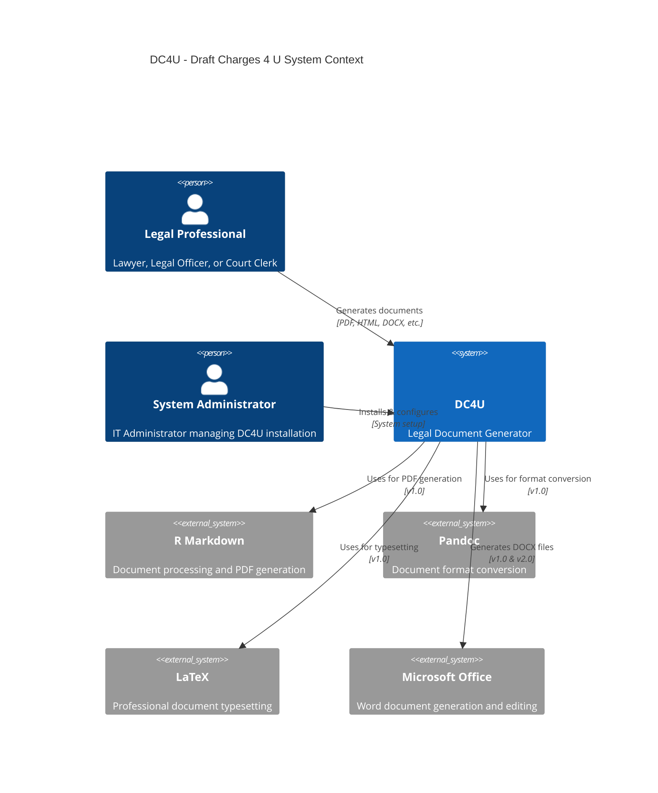
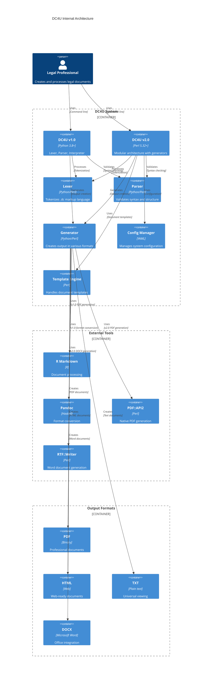

[](https://github.com/gongahkia/dc4u/releases/tag/1.0.0)
[](https://github.com/gongahkia/dc4u/releases/tag/2.0.0)

# `Draft Charges 4 U`

A Legal Draft Charge Creator.

## Motivation

[Draft charges](https://mustsharenews.com/wp-content/uploads/2018/12/TOC-Charge-Sheet.jpg) are inane to format. `DC4U` simplifies the entire process of creating Draft Charges, by transpiling a human-readable markup format (`.dc`) to different targets for viewing and distribution.

This format is intended to allow for quick integration with existing workflows when taking down material facts.

## Purpose

* Speed up process of formatting draft charges
* Small source code binary and compilation target, faster compilation times
* Simplify inane legal admin work for lawyers
* `DC4U` transpiler takes in a simple reworked markup format and transpiles to multiple targets
* Afraid you won't remember `.dc` language syntax? The `DC4U` transpiler will *kindly* point out the error and correct you accordingly.

## Stack

* *Language*: [Python 3.8+](https://www.python.org/) (v1.0), [Perl 5.32+](https://www.perl.org/) (v2.0)
* *Package Manager*: [pip](https://pip.pypa.io/) (v1.0), [CPAN](https://www.cpan.org/) (v2.0)
* *Document Processing*: [R Markdown](https://rmarkdown.rstudio.com/), [Pandoc](https://pandoc.org/), [LaTeX](https://www.latex-project.org/)
* *PDF Generation*: [PDF::API2](https://metacpan.org/pod/PDF::API2) (v2.0), [TinyTeX](https://yihui.org/tinytex/) (v1.0)
* *Office Integration*: [officedown](https://davidgohel.github.io/officedown/) (v1.0), [RTF::Writer](https://metacpan.org/pod/RTF::Writer) (v2.0)
* *Configuration*: [YAML](https://yaml.org/) (v2.0)
* *Build System*: [Make](https://www.gnu.org/software/make/) (v1.0 & v2.0)
* *Testing*: [Perl Test Framework](https://perldoc.perl.org/perlunitut) (v2.0)

## Output formats

| Output format | Purpose | Implementation status |
| :---: | :---: | :---: |
| `.txt` | Universal viewing and plain text output |  |
| `.md` | Markdown formatted viewing with HTML styling | |
| `.html` | Web-ready documents with CSS styling |  |
| `.rmd` | R Markdown for data visualization and analysis |  |
| `.pdf` | Professional documents via PDF::API2 (v2.0) or R/Pandoc (v1.0) |  |
| `.docx` | Microsoft Word documents via RTF::Writer (v2.0) or R/officedown (v1.0) | |

## Language syntax

Refer to [`samples/`](./samples/) for examples and expansion on `.dc` syntax.

| **stylisation** | **syntax** | **notes** | **implementation status** |
| :---: | :---: | :---: | :---: |
| Output format | \` ` | PDF, HTML, TXT, MD, RMD, DOCX |  |
| Suspect info | < > | Name; NRIC; Race; Age; Gender; Nationality |  |
| Charge details | [ ] | Title; Date of offence; Explanation |   |
| Legal statute | @ @ | Relevant statute or legal provision |  |
| Officer info | { } | Name; Role/Division; Date of charge |   |
| Comments | # # | Ignored in final output, for documentation |   |
| Separator | --- | Separates multiple charges in same file |   |

# Screenshots

Example of a draft charge created with `DC4U`


# Installation

This installation also handles R markdown default toolchain's installation, as well as compilation targets to `.pdf` and `.docx`.

## WSL (Debian)

```console
$ git clone https://github.com/gongahkia/dc4u
$ sudo apt update && sudo apt upgrade && sudo apt autoremove
$ sudo apt -y install r-base gdebi-core pandoc-citeproc
$ sudo apt install texlive-latex-base texlive-fonts-recommended texlive-latex-extra
$ sudo R
> install.packages("rmarkdown")
> install.packages("officedown")
> install.packages('tinytex')
> tinytex::install_tinytex()
> Save workspace image? [y/n/c]: n
$ exit
```

## OSX

```console
$ git clone https://github.com/gongahkia/dc4u
$ brew install r 
$ brew install pandoc
$ brew install --cask rstudio
$ R
> install.packages("rmarkdown")
> install.packages("officedown")
> install.packages('tinytex')
> tinytex::install_tinytex()
> Save workspace image? [y/n/c]: n
$ exit
```

## Architecture

### Overview



### Internal Architecture



## Reference

The name `dc4u` is in reference to [Funny Valentine](https://jojo.fandom.com/wiki/Funny_Valentine)'s (ファニー・ヴァレンタイン) [Stand](https://jojo.fandom.com/wiki/Stand) of the same name, [Dirty Deeds Done Dirt Cheap](https://jojo.fandom.com/wiki/Dirty_Deeds_Done_Dirt_Cheap) *(often shortened to D4C)* in [Part 7: Steel Ball Run](https://jojo.fandom.com/wiki/Steel_Ball_Run) of the ongoing manga series [JoJo's Bizarre Adventure](https://jojowiki.com/JoJo_Wiki).

<div align="center">
    
</div>
