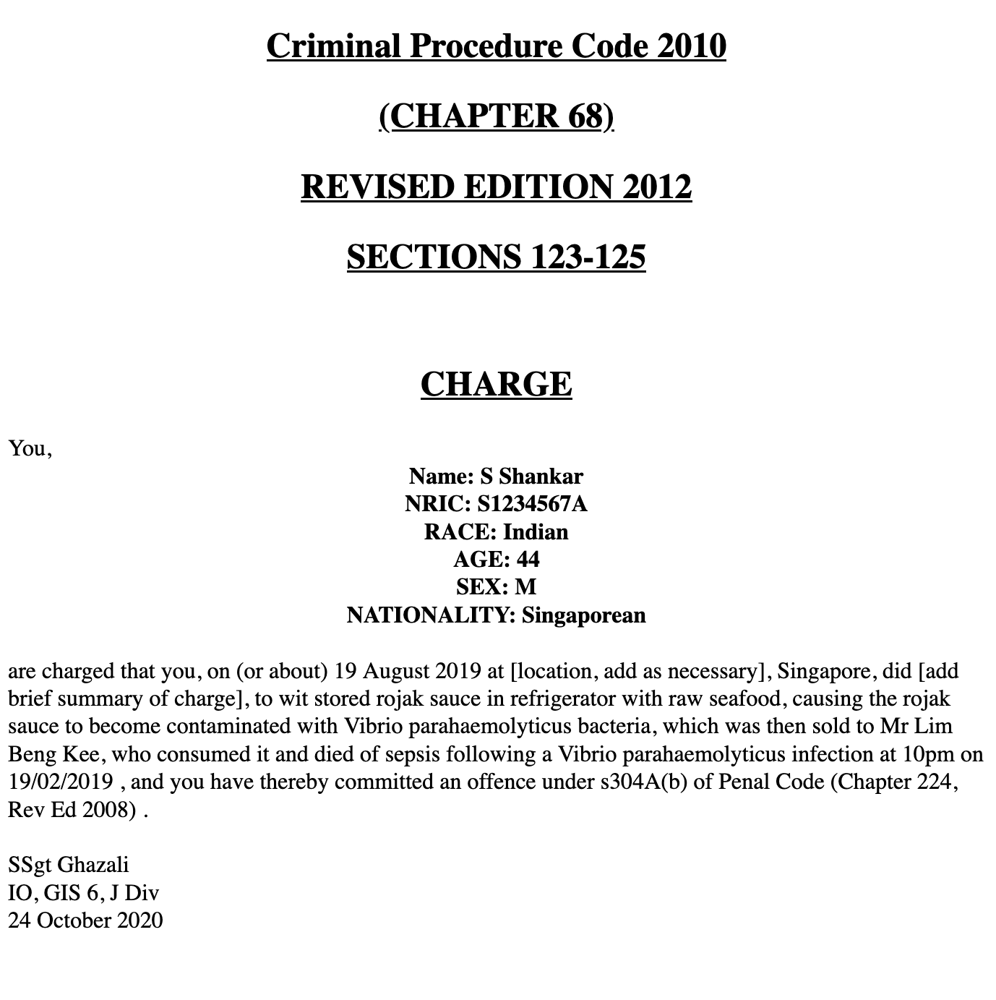

# Draft Charges 4 U

A Legal Draft Charge Creator.

## Motivation

[Draft charges](https://mustsharenews.com/wp-content/uploads/2018/12/TOC-Charge-Sheet.jpg) are inane to format. `DC4U` simplifies the entire process of creating Draft Charges, by transpiling a human-readable markup format (`.dc`) to different targets for viewing and distribution.

This format is intended to allow for quick integration with existing workflows when taking down material facts.

## Purpose

* Speed up process of formatting draft charges
* Small source code binary and compilation target, faster compilation times
* Simplify inane legal admin work for lawyers
* `DC4U` transpiler takes in a simple reworked markup format and transpiles to multiple targets
* Afraid you won't remember `.dc` language syntax? The `DC4U` transpiler will *kindly* point out the error and correct you accordingly.

## Output formats

| Output format | Purpose | Implementation status |
| :---: | :---: | :---: |
| `.txt` | Universal viewing |  |
| `.md` | Formatted viewing | |
| `.html` | Rudimentary API implementation |  |
| `.rmd` | Rudimentary integration of calculation and data vis | 
| `.pdf` | Widely accepted format for sharing and viewing. Relies on existing R and Pandoc toolchains. |  |
| `.docx` | Microsoft clowns and google doc integration. Relies on existing R and Pandoc toolchains. | |

## Language syntax

Refer to `samples/eg.dc` for examples and expansion on `.dc` syntax.

| **stylisation** | **syntax** | **notes** | **implementation status** |
| :---: | :---: | :---: | :---: |
| output format | \` ` | PDF, HTML, TXT, MD, DOC |  |
| Suspect name; NRIC; Race; Age; Gender; Nationality | < > | |  |
| Recommended charge title; Date of offence; Explication of charge | [ ] | |   |
| Relevant statute | @ @ | |  |
| Charging officer; Role and Division; Date of charge | { } | |   |
| Comments | # # | Comments are ignored in the final formatted draft charge |   |
| Separator | --- | |   |

# Screenshots

* Example of a draft charge created with `DC4U`



# Installation

## WSL (Debian)

```console
$ sudo apt update && sudo apt upgrade && sudo apt autoremove
$ sudo apt -y install r-base gdebi-core pandoc-citeproc
$ sudo apt install texlive-latex-base texlive-fonts-recommended texlive-latex-extra
$ sudo R
> install.packages("rmarkdown")
> install.packages("officedown")
```

## OSX

```console
$ git clone https://github.com/gongahkia/dc4u
$ brew install r 
$ brew install pandoc
$ brew install --cask rstudio
$ R
> install.packages("rmarkdown")
> install.packages("officedown")
```
